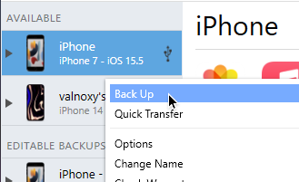
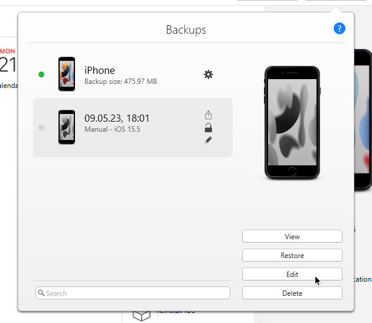
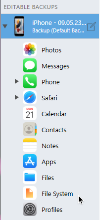
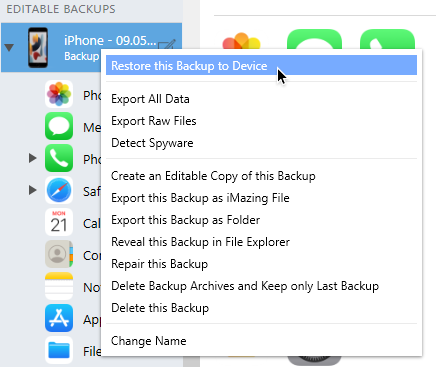

# How to remove MDM profile on iOS & iPadOS

This guide shows how to remove the MDM profile on iOS and iPadOS. 
> Important: If the device has been registered in Apple Business Manager, the MDM profile will be restored after a factory reset. 

## Tested devices
- iPhone 7 (iOS 15.5)
- iPhone 11 Pro (iOS 16.1)

---

## Requirements
- iMazing (or any other tool to modify iOS Backups)
- iOS / iPadOS backup

## Guide
### Creating a backup
1. Install iMazing
2. Connect your device and create a backup with iMazing


### Edit the backup
3. Click on the top-right on ```iPhone Backups```, select your backup and click on ```Edit```.

4. Select your backup on the left panel and select ```File System```.

5. Navigate to ```System Shared Containers -> SysSharedContainerDomain-systemgroup.com.apple.configurationprofiles -> Library -> ConfigurationProfiles```.
6. If exists, delete ```MDM.plist```, ```MDMEvents.plist``` & ```CloudConfigurationDetails.plist```.

### Restore backup
7. Right-click on the backup and select ```Restore this Backup to Device```.

8. Set the restore options to default and start the restoration.


After the restore, the MDM profile should be removed from the device.

<hr>
<h6 align="center">© 2018 - 2023 valnoxy. All Rights Reserved. 
<br>
By Jonas Günner &lt;jonas@exploitox.de&gt;</h6>
<p align="center">
	<a href="https://github.com/valnoxy/Dive/blob/main/LICENSE"></a>
</p